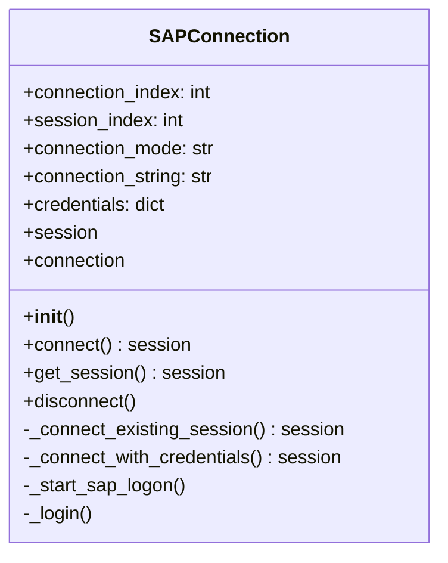
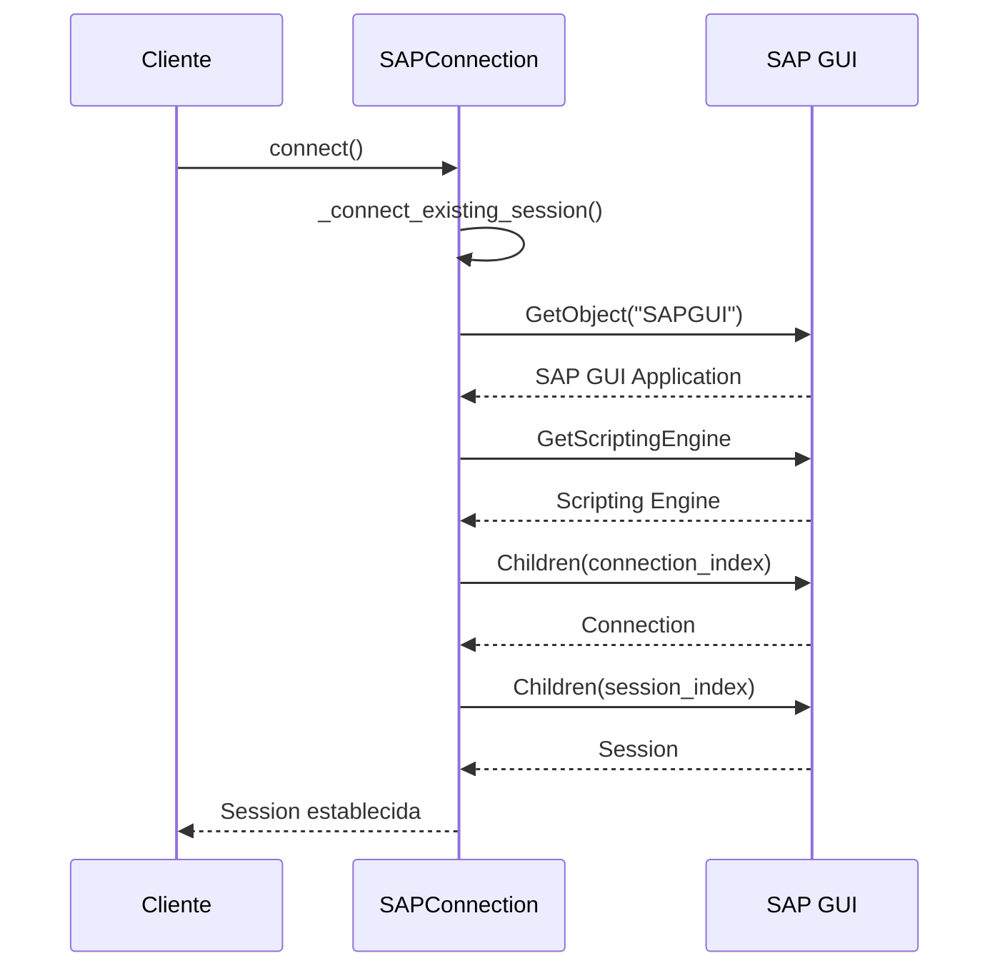
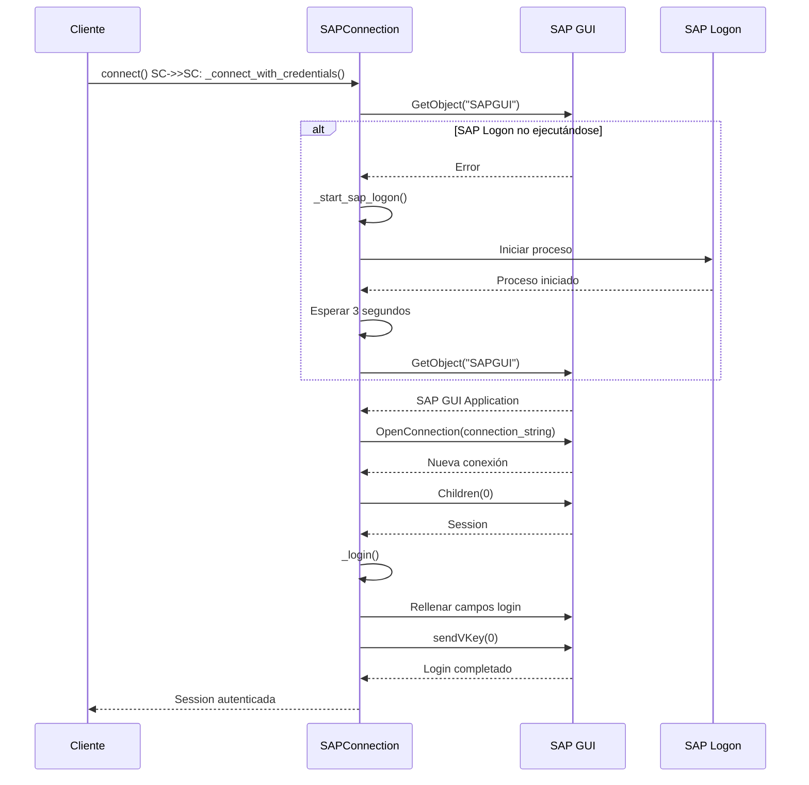
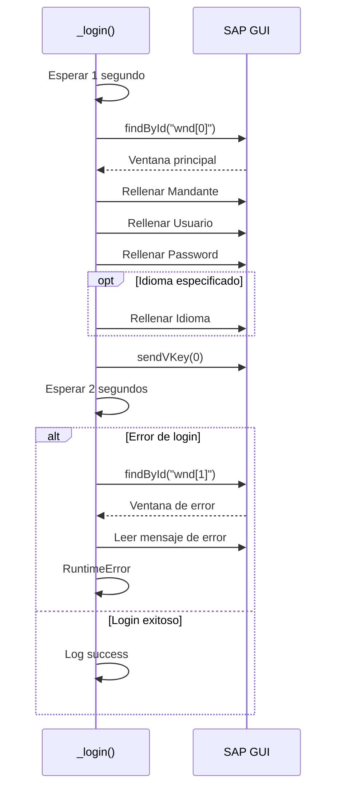
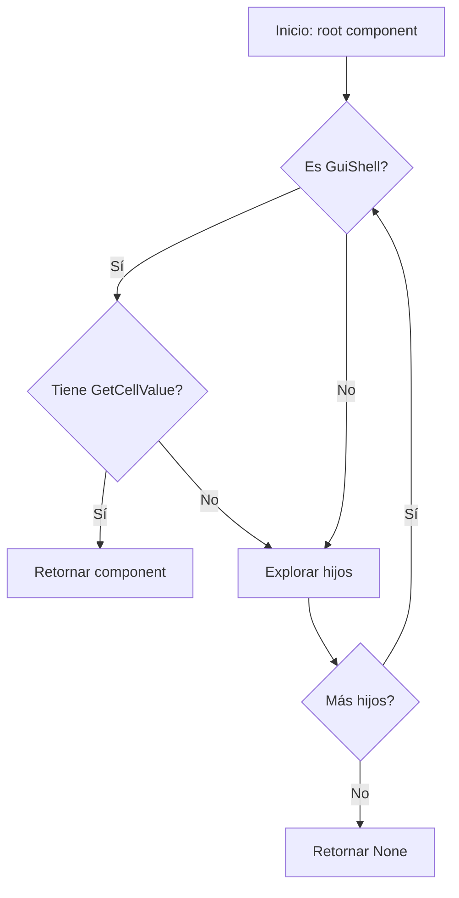
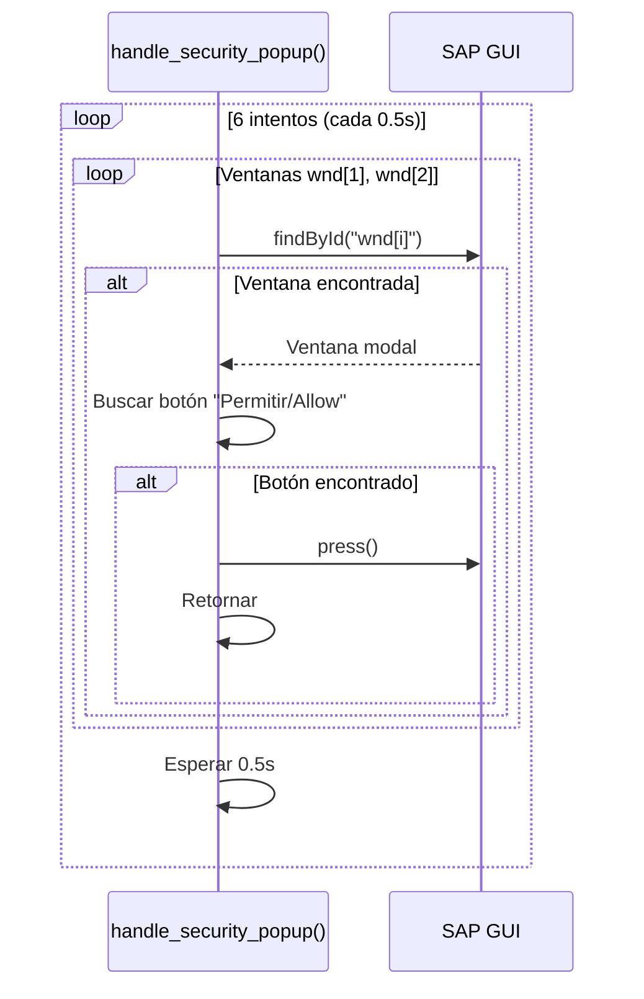
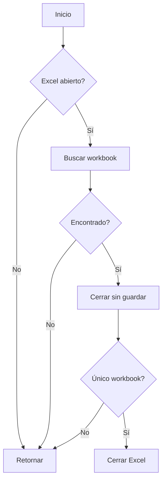

# Capa Core

La capa Core contiene los componentes fundamentales para interactuar con SAP GUI. Proporciona abstracción de bajo nivel para conexión, autenticación y manipulación de

 interfaces.

## Componentes

### SAPConnection

**Ubicación**: `src/core/sap_connection.py`

**Responsabilidad**: Gestionar conexión y autenticación con SAP GUI

#### Arquitectura



#### Flujo de Conexión - Modo Existing Session



#### Flujo de Conexión - Modo Credentials



#### Método: connect()

**Descripción**: Establece conexión con SAP basándose en el modo configurado

**Retorna**: Objeto session de SAP GUI

**Excepciones**:
- `ValueError`: Modo de conexión inválido
- `RuntimeError`: Error en conexión o autenticación
- `IndexError`: Índices fuera de rango

**Ejemplo de uso**:

```python
from src.core.sap_connection import SAPConnection

# Modo existing_session
conn = SAPConnection(
    connection_index=0,
    session_index=0,
    connection_mode="existing_session"
)
session = conn.connect()

# Modo credentials
credentials = {
    "username": "usuario",
    "password": "pass",
    "client": "300"
}
conn = SAPConnection(
    connection_mode="credentials",
    connection_string="ECOSISCAT - ESX - Produccio",
    credentials=credentials
)
session = conn.connect()
```

#### Método: _login()

**Descripción**: Realiza login automático rellenando campos de la pantalla

**Flujo**:



**Campos rellenados**:

| Campo | ID SAP | Variable |
|-------|--------|----------|
| Mandante | `wnd[0]/usr/txtRSYST-MANDT` | `client` |
| Usuario | `wnd[0]/usr/txtRSYST-BNAME` | `username` |
| Password | `wnd[0]/usr/pwdRSYST-BCODE` | `password` |
| Idioma | `wnd[0]/usr/txtRSYST-LANGU` | `language` |

---

### sap_utils

**Ubicación**: `src/core/sap_utils.py`

**Responsabilidad**: Utilidades para manipular componentes de SAP GUI

#### Funciones Principales

##### find_alv_shell()

**Descripción**: Localiza componentes ALV Grid en la interfaz SAP

**Flujo de búsqueda**:



**Firma**:

```python
def find_alv_shell(root) -> Optional[object]
```

**Parámetros**:
- `root`: Componente raíz desde donde buscar

**Retorna**:
- Componente `GuiShell` del ALV si se encuentra
- `None` si no se encuentra

**Ejemplo**:

```python
from src.core.sap_utils import find_alv_shell

wnd = session.findById("wnd[0]")
alv = find_alv_shell(wnd)

if alv:
    row_count = alv.RowCount
    column_count = alv.ColumnCount
```

##### handle_security_popup()

**Descripción**: Detecta y acepta popups de seguridad de SAP

**Flujo**:



##### close_excel_workbook()

**Descripción**: Cierra libro Excel abierto por SAP tras exportación

**Parámetros**:
- `full_path`: Ruta completa del archivo Excel

**Flujo**:



## Patrones de Uso

### Inicialización de Conexión

```python
from src.core.sap_connection import SAPConnection
from src.utils.credential_manager import get_credentials

# Cargar credenciales
credentials = get_credentials()

# Inicializar conexión
sap_conn = SAPConnection(
    connection_mode="credentials",
    connection_string="Sistema SAP",
    credentials=credentials
)

# Conectar
session = sap_conn.connect()

# Usar sesión
session.findById("wnd[0]/tbar[0]/okcd").Text = "/nSE38"
session.findById("wnd[0]").sendVKey(0)

# Limpiar
sap_conn.disconnect()
```

### Búsqueda y Manipulación de ALV

```python
from src.core.sap_utils import find_alv_shell

# Ejecutar transacción que muestra ALV
session.findById("wnd[0]/tbar[0]/okcd").Text = "/nSE16"
session.findById("wnd[0]").sendVKey(0)

# Buscar ALV
wnd = session.findById("wnd[0]")
alv = find_alv_shell(wnd)

if alv:
    # Leer datos
    for row in range(alv.RowCount):
        for col in range(alv.ColumnCount):
            value = alv.GetCellValue(row, col)
            print(f"[{row},{col}] = {value}")
```

## Consideraciones Técnicas

### Thread Safety

Los componentes Core **no son thread-safe**. Cada thread debe tener su propia instancia de `SAPConnection`.

### Gestión de Recursos

Las conexiones SAP deben cerrarse explícitamente:

```python
try:
    session = sap_conn.connect()
    # Usar sesión
finally:
    sap_conn.disconnect()
```

### Timeouts

Tiempos de espera configurables:

- Login: 1s antes, 2s después
- Inicio SAP Logon: 3s
- Popup seguridad: hasta 3s (6 intentos × 0.5s)

## Manejo de Errores

### Errores Comunes

| Error | Causa | Solución |
|-------|-------|----------|
| `RuntimeError: No open connections` | SAP GUI no abierto | Iniciar SAP Logon |
| `IndexError: connection_index out of range` | Índice inválido | Verificar índices en config |
| `RuntimeError: SAP Login failed` | Credenciales incorrectas | Validar credenciales |
| `ValueError: connection_string required` | Falta connection_string | Configurar en settings.yaml |

### Logging

Todos los errores se registran con contexto completo:

```python
logger.error(f"Failed to connect with credentials: {e}")
logger.warning(f"Could not set client field: {e}")
logger.info(f"Login successful")
```

## Próximas Secciones

- [Capa Utils](utils.md): Herramientas de soporte
- [Capa Scripts](scripts.md): Crear scripts personalizados
