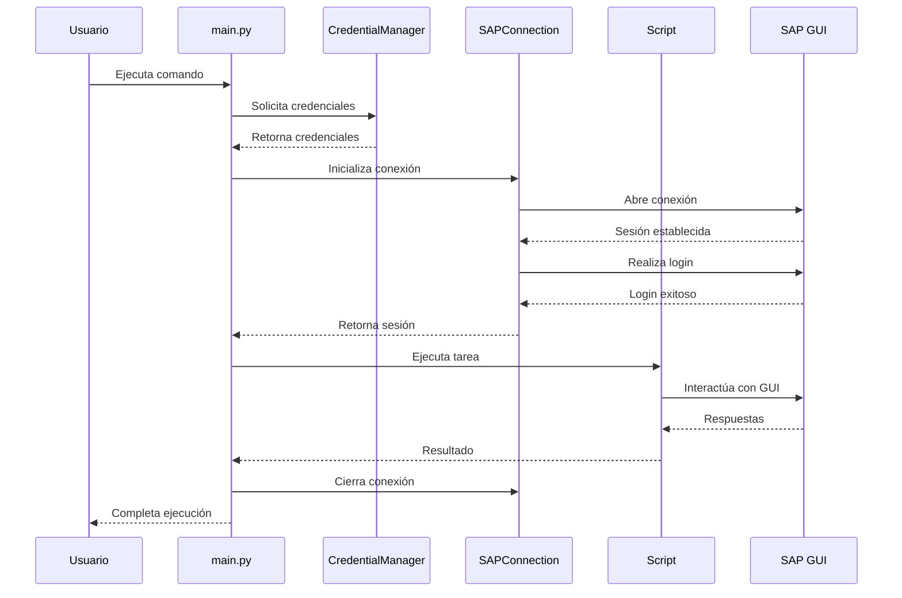
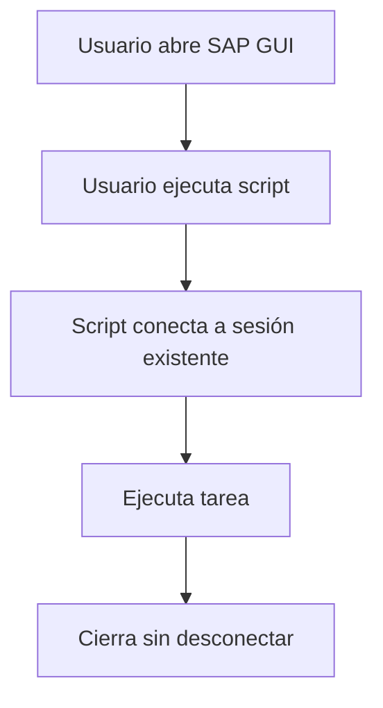
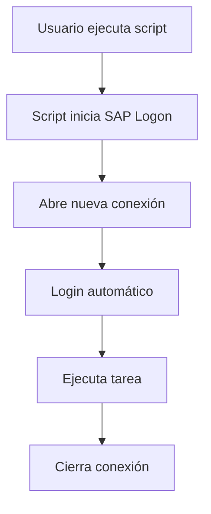
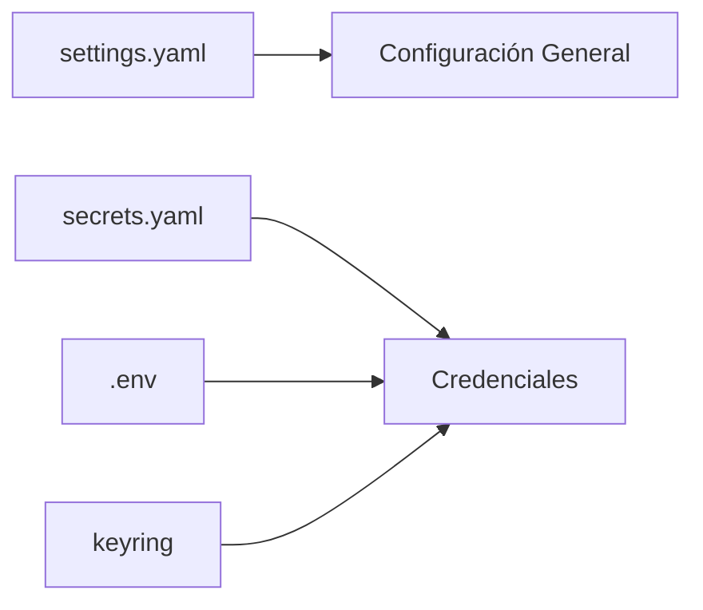
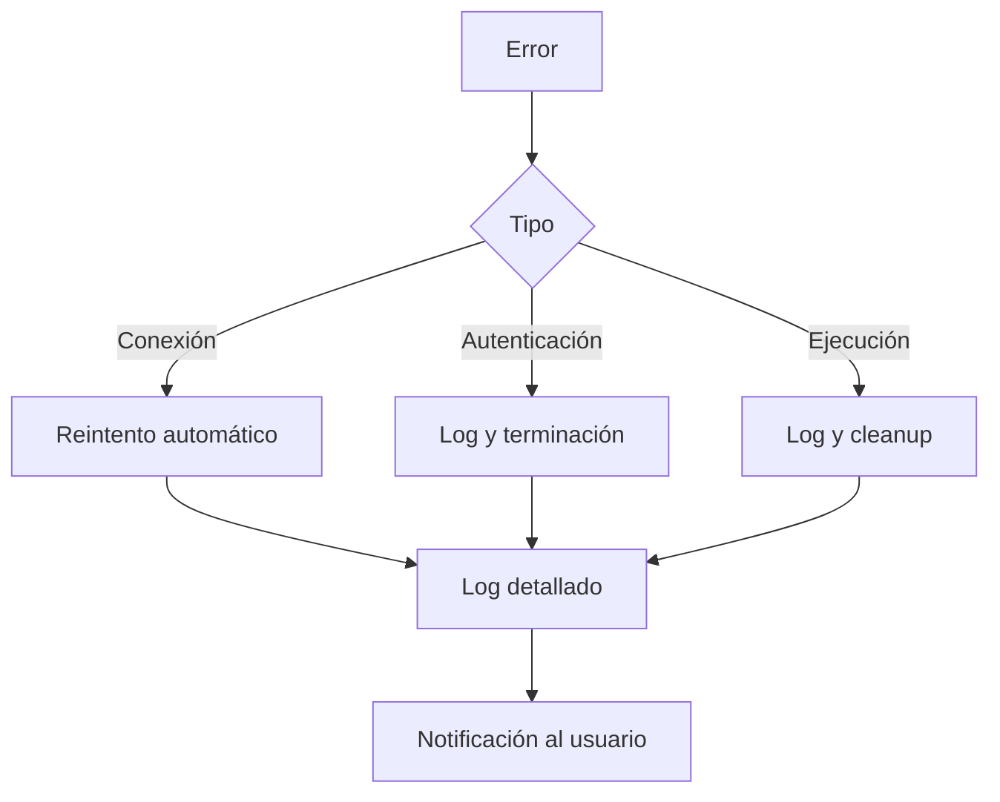

# Visión General de la Arquitectura

El sistema de automatización SAP está diseñado con una arquitectura en capas que separa responsabilidades y facilita la extensibilidad.

## Principios de Diseño

### Separación de Responsabilidades

Cada capa tiene una función específica y bien definida:

- **Core**: Funcionalidad fundamental de conexión SAP
- **Scripts**: Lógica de negocio y tareas específicas
- **Utils**: Herramientas transversales y soporte

### Modularidad

Los componentes están diseñados para ser:

- Independientes entre sí
- Reutilizables en diferentes contextos
- Fáciles de testear
- Simples de mantener

### Extensibilidad

La arquitectura permite agregar nuevas funcionalidades sin modificar código existente.

## Estructura del Proyecto

```
scripts_SAP/
├── src/                   # Código fuente
│   ├── core/             # Capa fundamental
│   │   ├── sap_connection.py
│   │   └── sap_utils.py
│   ├── scripts/          # Capa de aplicación
│   │   └── [scripts de tareas]
│   └── utils/            # Capa de soporte
│       ├── credential_manager.py
│       ├── logger.py
│       └── sap_inspector.py
├── config/               # Configuración
│   ├── settings.yaml
│   └── secrets.yaml
├── exports/              # Salidas
├── logs/                 # Registros
├── docs/                 # Documentación
└── main.py              # Punto de entrada
```

## Capas del Sistema

### 1. Capa Core

**Responsabilidad**: Gestión de conexión y operaciones fundamentales SAP

**Componentes**:

- `SAPConnection`: Gestión de conexión y autenticación
- `sap_utils`: Utilidades para manipulación de interfaces SAP

**Características**:

- Sin dependencias de lógica de negocio
- Reutilizable en cualquier automatización SAP
- Manejo robusto de errores

### 2. Capa Scripts

**Responsabilidad**: Implementación de tareas específicas de negocio

**Características**:

- Cada script es independiente
- Usa componentes de Core y Utils
- Enfocado en lógica de negocio

### 3. Capa Utils

**Responsabilidad**: Servicios transversales y herramientas de desarrollo

**Componentes**:

- `credential_manager`: Gestión de credenciales
- `logger`: Sistema de logging
- `sap_inspector`: Herramienta de exploración

## Flujo de Ejecución



## Modos de Operación

### Modo Existing Session

Conecta a una sesión SAP GUI ya abierta manualmente:



**Uso**: Desarrollo y operaciones interactivas

### Modo Credentials

Login automático con credenciales almacenadas:



**Uso**: Automatización desatendida y scripts programados

## Gestión de Configuración

### Archivos de Configuración



### Prioridad de Credenciales

1. `config/secrets.yaml` (más común)
2. Variables de entorno (`.env`)
3. Keyring del sistema (más seguro)

## Gestión de Errores

El sistema implementa manejo de errores en múltiples niveles:



## Logging

Sistema de logging centralizado:

- **Nivel INFO**: Operaciones normales
- **Nivel WARNING**: Situaciones anómalas no críticas
- **Nivel ERROR**: Errores recuperables
- **Nivel CRITICAL**: Errores fatales

Salida dual:

- Consola: Información en tiempo real
- Archivo: Registro persistente en `logs/app.log`

## Seguridad

### Almacenamiento de Credenciales

- Archivo `secrets.yaml` excluido de git
- Soporte para keyring del sistema operativo
- Sin credenciales hardcodeadas en código

### Buenas Prácticas

- Credenciales separadas de configuración
- Logging sin exponer passwords
- Validación de entrada de usuario
- Manejo seguro de excepciones

## Próximas Secciones

- [Capa Core](core.md): Detalles de conexión y utilidades SAP
- [Capa Utils](utils.md): Herramientas de soporte
- [Capa Scripts](scripts.md): Guía para crear scripts personalizados
