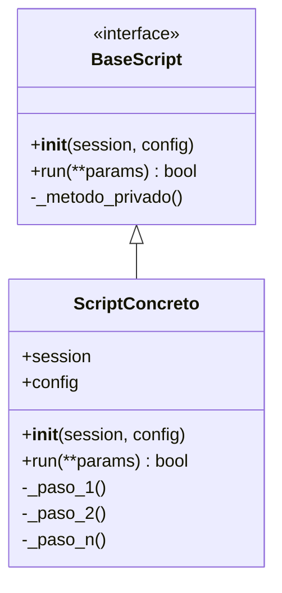
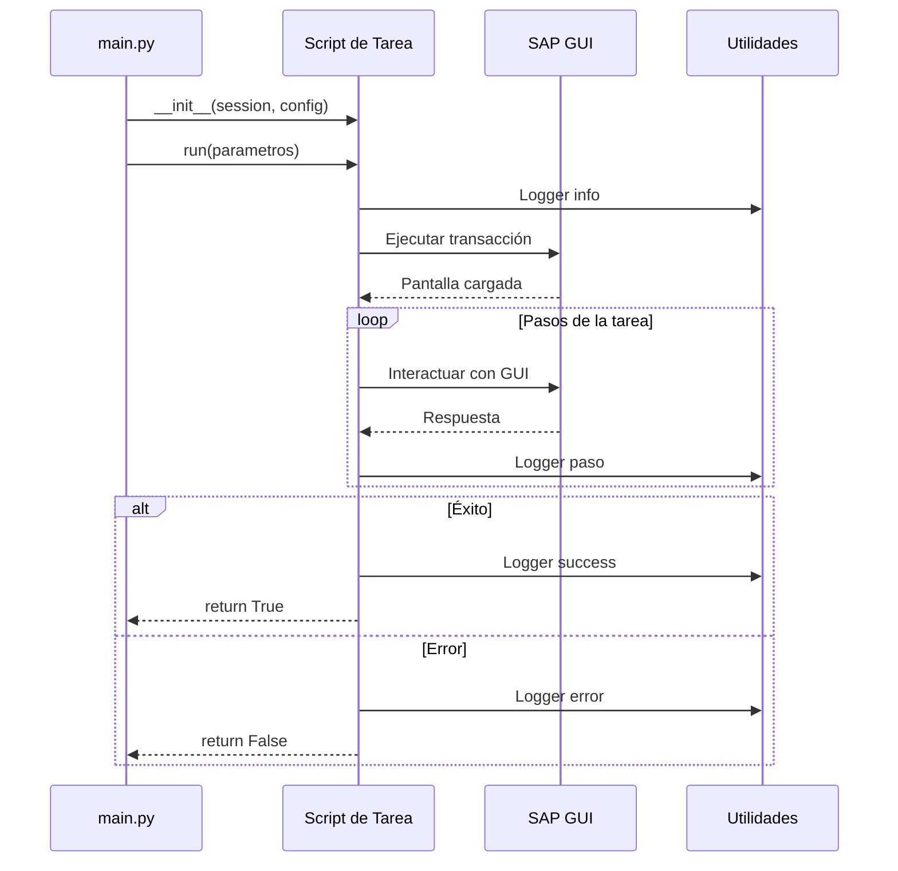

# Capa Scripts

La capa Scripts contiene la lógica de negocio específica para cada tarea de automatización. Cada script es independiente y reutiliza componentes de las capas Core y Utils.

## Arquitectura de Scripts

### Patrón de Diseño

Todos los scripts siguen un patrón consistente:



### Flujo de Ejecución Genérico



## Estructura de un Script

### Template Básico

```python
import logging
from typing import Any, Dict

logger = logging.getLogger("SAP_Automation")

class MiTarea:
    """
    Descripción de la tarea que realiza el script.
    
    Attributes:
        session: Sesión SAP activa
        config: Configuración del sistema
    """
    
    def __init__(self, session, config: Dict[str, Any]):
        """
        Inicializa el script con sesión y configuración.
        
        Args:
            session: Sesión SAP GUI activa
            config: Diccionario de configuración
        """
        self.session = session
        self.config = config
    
    def run(self, parametro1: str, parametro2: int = 0) -> bool:
        """
        Ejecuta la tarea principal.
        
        Args:
            parametro1: Descripción del parámetro
            parametro2: Descripción del parámetro opcional
            
        Returns:
            True si la ejecución fue exitosa, False en caso contrario
        """
        logger.info(f"Iniciando MiTarea con {parametro1}")
        
        try:
            # Paso 1
            self._paso_1(parametro1)
            
            # Paso 2
            self._paso_2(parametro2)
            
            # Paso N
            self._finalizar()
            
            logger.info("MiTarea completada exitosamente")
            return True
            
        except Exception as e:
            logger.error(f"Error en MiTarea: {e}")
            return False
    
    def _paso_1(self, param: str) -> None:
        """Paso privado 1: Descripción."""
        logger.debug(f"Ejecutando paso 1 con {param}")
        # Implementación
    
    def _paso_2(self, param: int) -> None:
        """Paso privado 2: Descripción."""
        logger.debug(f"Ejecutando paso 2 con {param}")
        # Implementación
    
    def _finalizar(self) -> None:
        """Cleanup y finalización."""
        logger.debug("Finalizando tarea")
        # Implementación
```

## Integración con main.py

### Registro del Script

```python
# En main.py
from src.scripts.mi_tarea import MiTarea

def main():
    # ... código de conexión ...
    
    # Agregar nuevo case en dispatch
    if args.task == "mi_tarea":
        if not args.parametro1:
            logger.error("parametro1 es requerido")
            sys.exit(1)
        
        tarea = MiTarea(session, config)
        success = tarea.run(
            parametro1=args.parametro1,
            parametro2=args.parametro2
        )
        
        if success:
            logger.info("Tarea completada")
        else:
            logger.error("Tarea falló")
            sys.exit(1)
```

### Argumentos CLI

```python
# Agregar argumentos en main.py
parser.add_argument("--task", choices=["export_invoice", "mi_tarea"])
parser.add_argument("--parametro1", type=str, help="Descripción")
parser.add_argument("--parametro2", type=int, default=0, help="Descripción")
```

## Buenas Prácticas

### 1. Separación de Responsabilidades

```python
class BuenScript:
    def run(self, dato):
        # Orquestación de alto nivel
        self._validar_entrada(dato)
        resultado = self._procesar(dato)
        self._guardar_resultado(resultado)
        return True
    
    def _validar_entrada(self, dato):
        # Validación específica
        pass
    
    def _procesar(self, dato):
        # Lógica de negocio
        pass
    
    def _guardar_resultado(self, resultado):
        # Persistencia
        pass
```

### 2. Manejo de Errores

```python
class ScriptRobusto:
    def run(self, param):
        try:
            self._paso_critico(param)
            return True
        except ComponentNotFoundError as e:
            logger.error(f"Componente no encontrado: {e}")
            return False
        except TimeoutError as e:
            logger.error(f"Timeout en operación: {e}")
            return False
        except Exception as e:
            logger.critical(f"Error inesperado: {e}")
            return False
        finally:
            self._cleanup()
```

### 3. Uso de Configuración

```python
class ScriptConfigurable:
    def __init__(self, session, config):
        self.session = session
        self.config = config
        
        # Leer configuración específica
        self.timeout = config.get('timeouts', {}).get('default_wait', 0.5)
        self.export_dir = config.get('export', {}).get('default_directory')
    
    def run(self):
        # Usar configuración
        time.sleep(self.timeout)
        output_path = os.path.join(self.export_dir, "resultado.csv")
```

### 4. Logging Apropiado

```python
class ScriptConLog:
    def run(self, id_documento):
        logger.info(f"Procesando documento: {id_documento}")
        
        try:
            logger.debug("Iniciando transacción SE38")
            self._ejecutar_transaccion()
            
            logger.debug(f"Buscando documento {id_documento}")
            encontrado = self._buscar_documento(id_documento)
            
            if not encontrado:
                logger.warning(f"Documento {id_documento} no encontrado")
                return False
            
            logger.info("Documento procesado exitosamente")
            return True
            
        except Exception as e:
            logger.error(f"Error procesando {id_documento}: {e}", exc_info=True)
            return False
```

## Patrones Comunes

### Búsqueda y Filtrado

```python
def _aplicar_filtros(self, filtros: Dict[str, str]) -> None:
    """Aplica filtros en pantalla de selección."""
    for campo_id, valor in filtros.items():
        try:
            campo = self.session.findById(campo_id)
            campo.Text = valor
            logger.debug(f"Filtro aplicado: {campo_id} = {valor}")
        except:
            logger.warning(f"Campo no encontrado: {campo_id}")
```

### Exportación de Datos

```python
from src.core.sap_utils import find_alv_shell, handle_security_popup
import time
from datetime import datetime

def _exportar_alv(self) -> str:
    """Exporta datos de ALV a CSV."""
    # Encontrar ALV
    wnd = self.session.findById("wnd[0]")
    alv = find_alv_shell(wnd)
    
    if not alv:
        raise RuntimeError("ALV no encontrado")
    
    # Trigger export
    alv.ContextMenu()
    alv.SelectContextMenuItem("&XXL")
    
    # Configurar exportación
    wnd1 = self.session.findById("wnd[1]")
    filename = f"export_{datetime.now():%Y%m%d_%H%M%S}.csv"
    
    # ... configuración de formato ...
    
    # Manejar popup de seguridad
    handle_security_popup(self.session)
    
    return filename
```

### Navegación por Transacciones

```python
def _ejecutar_transaccion(self, tcode: str) -> None:
    """Ejecuta transacción SAP."""
    logger.debug(f"Ejecutando transacción: {tcode}")
    self.session.findById("wnd[0]/tbar[0]/okcd").Text = tcode
    self.session.findById("wnd[0]").sendVKey(0)
    time.sleep(self.config.get('timeouts', {}).get('default_wait', 0.5))
```

## Testing de Scripts

### Estructura de Tests

```python
# tests/test_mi_tarea.py
import unittest
from unittest.mock import Mock, patch
from src.scripts.mi_tarea import MiTarea

class TestMiTarea(unittest.TestCase):
    def setUp(self):
        self.session_mock = Mock()
        self.config = {
            'timeouts': {'default_wait': 0.1}
        }
        self.tarea = MiTarea(self.session_mock, self.config)
    
    def test_run_exitoso(self):
        result = self.tarea.run("param1")
        self.assertTrue(result)
    
    def test_run_con_error(self):
        self.session_mock.findById.side_effect = Exception("Error")
        result = self.tarea.run("param1")
        self.assertFalse(result)
```

## Ejemplo Completo

Ver la guía [Crear Nuevo Script](../guias/crear-script.md) para un tutorial paso a paso con un ejemplo completo funcional.

## Checklist de Nuevo Script

- [ ] Crear clase con `__init__(session, config)`
- [ ] Implementar método `run()` que retorna bool
- [ ] Dividir lógica en métodos privados
- [ ] Agregar logging apropiado
- [ ] Manejar excepciones
- [ ] Usar configuración del sistema
- [ ] Agregar docstrings
- [ ] Integrar en main.py
- [ ] Agregar argumentos CLI si necesario
- [ ] Crear tests unitarios
- [ ] Documentar parámetros y comportamiento

## Próximas Secciones

- [Crear Nuevo Script](../guias/crear-script.md): Tutorial completo
- [Configuración](../referencia/configuracion.md): Opciones disponibles
