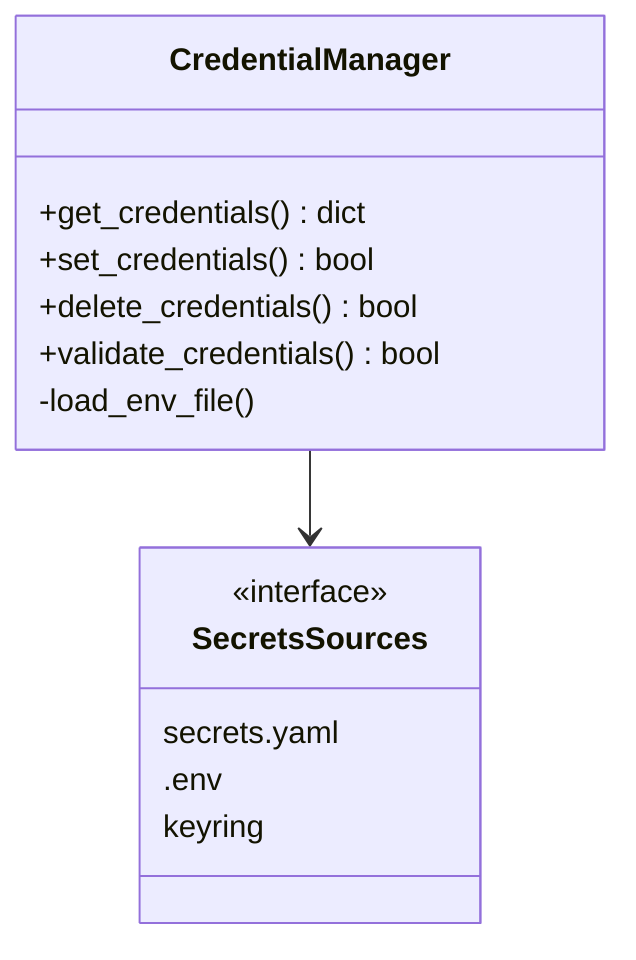
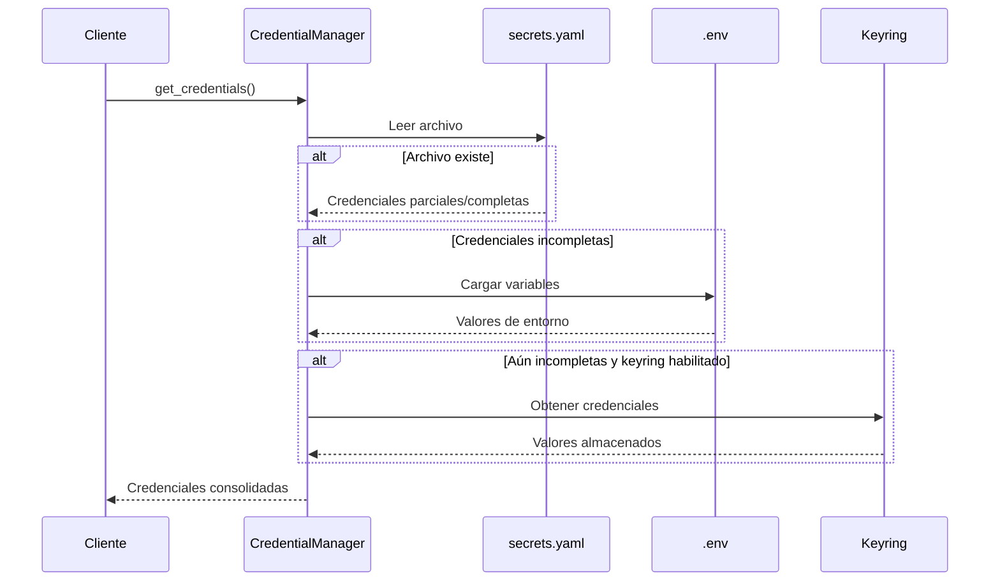
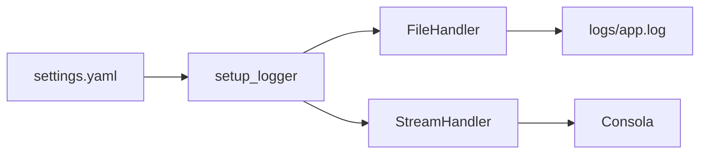
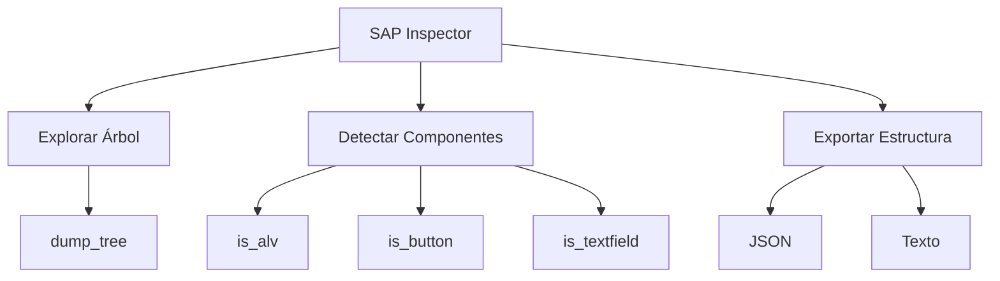
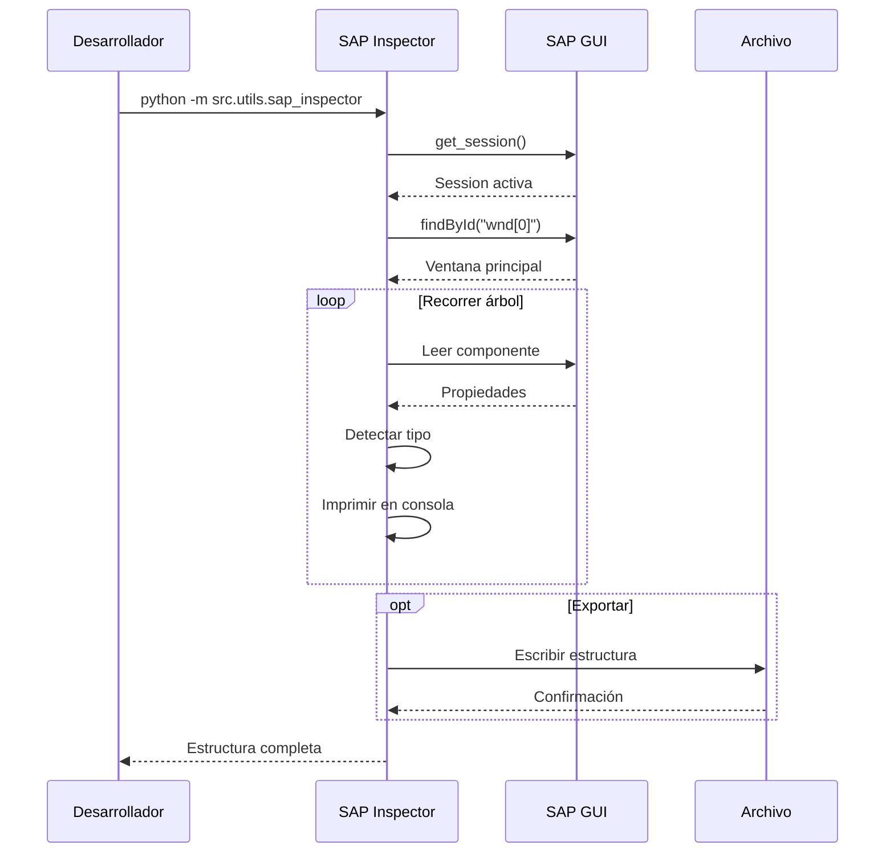

# Capa Utils

La capa Utils proporciona servicios transversales y herramientas de desarrollo que son utilizadas por todas las demás capas del sistema.

## Componentes

### Credential Manager

**Ubicación**: `src/utils/credential_manager.py`

**Responsabilidad**: Gestión segura de credenciales SAP

#### Arquitectura



#### Flujo de Obtención de Credenciales



#### Prioridad de Fuentes

1. **`config/secrets.yaml`** (prioridad alta)
   - Archivo YAML con credenciales
   - Más simple para desarrollo
   - Excluido de git

2. **Variables de entorno** (prioridad  media)
   - Desde archivo `.env`
   - Ideal para contenedores

3. **Keyring del sistema** (prioridad baja, más seguro)
   - Windows Credential Manager
   - Encriptado por el SO

#### API

##### get_credentials()

**Firma**:
```python
def get_credentials(
    use_keyring: bool = False, 
    env_path: str = ".env", 
    secrets_path: str = "config/secrets.yaml"
) -> Dict[str, Optional[str]]
```

**Retorna**:
```python
{
    "username": str | None,
    "password": str | None,
    "client": str | None,
    "system_id": str | None,
    "language": str | None
}
```

**Ejemplo**:
```python
from src.utils.credential_manager import get_credentials

creds = get_credentials()
if creds["username"]:
    print(f"Usuario: {creds['username']}")
```

##### validate_credentials()

**Firma**:
```python
def validate_credentials(
    credentials: Dict[str, Optional[str]], 
    require_all: bool = True
) -> bool
```

**Validación**:
- Campos requeridos: `username`, `password`
- Campos opcionales: `client`, `system_id`, `language`

---

### Logger

**Ubicación**: `src/utils/logger.py`

**Responsabilidad**: Sistema centralizado de logging

#### Configuración



#### Niveles de Log

| Nivel | Uso | Ejemplo |
|-------|-----|---------|
| DEBUG | Información detallada para debugging | `logger.debug("Valor de variable X")` |
| INFO | Operaciones normales | `logger.info("Conexión establecida")` |
| WARNING | Situaciones anómalas no críticas | `logger.warning("Keyring no disponible")` |
| ERROR | Errores recuperables | `logger.error("Fallo en operación X")` |
| CRITICAL | Errores fatales | `logger.critical("No se puede conectar")` |

#### Formato de Log

```
%(asctime)s - %(name)s - %(levelname)s - %(message)s
```

**Ejemplo de salida**:
```
2025-11-27 19:00:00,123 - SAP_Automation - INFO - Login successful
2025-11-27 19:00:01,456 - SAP_Automation - ERROR - Failed to find ALV: Component not found
```

#### API

##### setup_logger()

**Firma**:
```python
def setup_logger(config_path: str = "config/settings.yaml") -> logging.Logger
```

**Retorna**: Logger configurado para "SAP_Automation"

**Uso**:
```python
from src.utils.logger import setup_logger

logger = setup_logger()
logger.info("Aplicación iniciada")
```

---

### SAP Inspector

**Ubicación**: `src/utils/sap_inspector.py`

**Responsabilidad**: Herramienta de exploración de interfaces SAP para desarrollo

#### Funcionalidades



#### Flujo de Inspección



#### API

##### inspect_window()

**Firma**:
```python
def inspect_window(
    session, 
    window_id: str = "wnd[0]", 
    max_depth: Optional[int] = None
) -> Dict[str, Any]
```

**Parámetros**:
- `session`: Sesión SAP activa
- `window_id`: ID de ventana a inspeccionar
- `max_depth`: Profundidad máxima de exploración

**Retorna**: Estructura de árbol en formato dict

##### export_structure()

**Firma**:
```python
def export_structure(
    structure: Dict[str, Any], 
    output_file: str, 
    format: str = "json"
) -> None
```

**Formatos soportados**:
- `json`: Estructura jerarquizada
- `txt`: Árbol de texto plano

#### Uso desde CLI

```bash
# Inspección básica
python -m src.utils.sap_inspector

# Exportar a JSON
python -m src.utils.sap_inspector --output estructura.json

# Exportar a texto
python -m src.utils.sap_inspector --output estructura.txt --format txt

# Ventana específica
python -m src.utils.sap_inspector --window-id "wnd[1]"

# Limitar profundidad
python -m src.utils.sap_inspector --max-depth 5
```

#### Detección de Componentes

**Marcadores en salida**:

- `[ALV]`: Grid ALV detectado
- `[BTN]`: Botón
- `[TXT]`: Campo de texto

**Ejemplo de salida**:
```
GuiMainWindow | wnd[0] | wnd[0]
  GuiTitlebar | titl | wnd[0]/titl
  GuiToolbar | tbar[0] | wnd[0]/tbar[0]
  GuiUserArea | usr | wnd[0]/usr
    GuiShell | shell | wnd[0]/usr/shell [ALV]
    GuiButton | btn[8] | wnd[0]/tbar[1]/btn[8] [BTN]
```

#### Uso Programático

```python
from src.utils.sap_inspector import inspect_window, export_structure
from src.core.sap_connection import SAPConnection

# Conectar a SAP
conn = SAPConnection(connection_mode="existing_session")
session = conn.connect()

# Inspeccionar ventana actual
structure = inspect_window(session, "wnd[0]", max_depth=10)

# Exportar a archivo
export_structure(structure, "mi_pantalla.json", format="json")

# Analizar estructura
def find_buttons(node, path=""):
    if node.get("is_button"):
        print(f"Botón encontrado: {path}/{node['id']}")
    
    for child in node.get("children", []):
        find_buttons(child, f"{path}/{node['id']}")

find_buttons(structure)
```

## Patrones de Uso

### Configuración de Logging Personalizado

```python
from src.utils.logger import setup_logger
import logging

logger = setup_logger()

# Cambiar nivel temporalmente
logger.setLevel(logging.DEBUG)

# Log estructurado
logger.info("Operación completada", extra={
    "duration": 1.23,
    "records": 100
})
```

### Gestión de Credenciales Multi-entorno

```python
from src.utils.credential_manager import get_credentials
import os

# Desarrollo
os.environ["SAP_ENV"] = "dev"
dev_creds = get_credentials(secrets_path="config/secrets.dev.yaml")

# Producción
os.environ["SAP_ENV"] = "prod"
prod_creds = get_credentials(secrets_path="config/secrets.prod.yaml")
```

### Inspección Durante Desarrollo

```python
from src.utils.sap_inspector import get_component_info, dump_tree

# Explorar componente específico
component = session.findById("wnd[0]/usr/cntlGRID1/shellcont/shell")
info = get_component_info(component)

print(f"Tipo: {info['Type']}")
print(f"Es ALV: {info['is_alv']}")

if info['is_alv']:
    print(f"Filas: {info['RowCount']}")
    print(f"Columnas: {info['ColumnCount']}")

# Explorar subárbol
dump_tree(component, max_depth=3)
```

## Consideraciones Técnicas

### Seguridad de Credenciales

- Archivo `secrets.yaml` debe estar en `.gitignore`
- Keyring requiere permisos de usuario
- Variables de entorno no persisten entre sesiones

### Performance del Inspector

- La inspección profunda puede ser lenta en interfaces complejas
- Usar `max_depth` para limitar exploración
- Cachear estructuras para reutilización

### Logging en Producción

- Nivel INFO o WARNING en producción
- DEBUG solo para desarrollo
- Rotar logs periódicamente
- Excluir passwords de logs

## Próximas Secciones

- [Capa Scripts](scripts.md): Guía para crear scripts
- [Crear Nuevo Script](../guias/crear-script.md): Tutorial paso a paso
