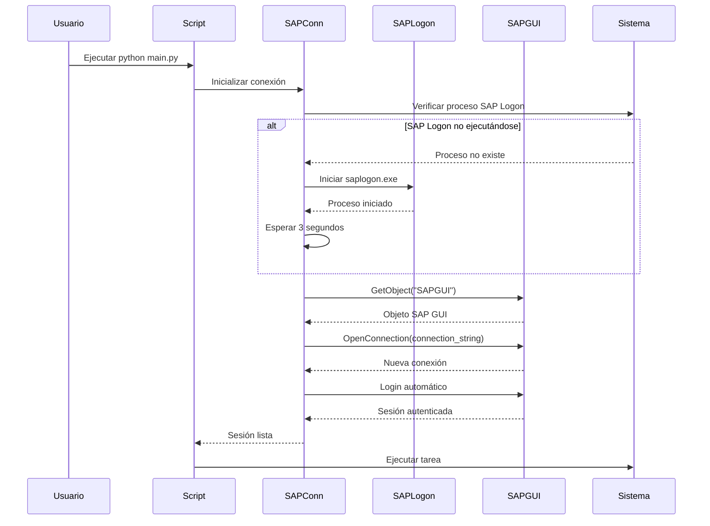
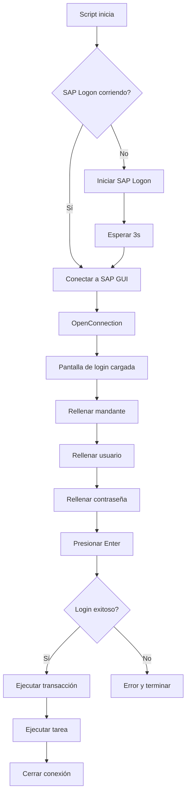

# Arranque en Frío

Guía para iniciar el sistema completamente desde cero, sin sesiones SAP previas ni configuración previa.

## Escenario

El arranque en frío se aplica cuando:

- El sistema se ejecuta por primera vez
- SAP Logon está completamente cerrado
- No hay sesiones SAP activas
- Se usa modo `credentials` (login automático)

## Flujo de Arranque en Frío



## Pasos Detallados

### 1. Verificación del Entorno

```powershell
# Asegurar que todo está cerrado
taskkill /F /IM saplogon.exe /T 2>$null
taskkill /F /IM sapgui.exe /T 2>$null
```

### 2. Configuración Verificada

Confirmar que existe:

- ✅ `config/settings.yaml` configurado
- ✅ `config/secrets.yaml` con credenciales
- ✅ Módulo de seguridad SAP GUI desactivado

#### Verificar settings.yaml

```powershell
# Debe contener
python -c "import yaml; c=yaml.safe_load(open('config/settings.yaml')); print(c['sap']['connection_mode'])"
# Output esperado: credentials
```

#### Verificar secrets.yaml

```powershell
python -m src.utils.credential_manager get
# Debe mostrar credenciales
```

#### Verificar Seguridad SAP GUI

1. Abrir SAP Logon (se cerrará luego)
2. `ALT + F12` → Seguridad → Configuración de seguridad
3. Verificar: **"Modul de seguretat"** = **"Desactivats"**
4. Cerrar SAP Logon

### 3. Ejecutar Arranque en Frío

```powershell
# Navegar al proyecto
cd c:\Users\Z1081401\Desktop\scripts_SAP

# Activar entorno virtual
.\venv\Scripts\Activate.ps1

# Ejecutar tarea (ejemplo: exportación)
python main.py --task export_invoice --invoice 2025102419
```

### 4. Secuencia de Eventos



## Tiempos Típicos

| Fase | Duración |
|------|----------|
| Inicio SAP Logon | 2-3 segundos |
| Conexión a SAP GUI | 1 segundo |
| Apertura de conexión | 2-3 segundos |
| Login automático | 2-3 segundos |
| Carga de transacción | 1-2 segundos |
| **Total arranque frío** | **8-12 segundos** |

Comparado con:
- **Arranque con sesión existente**: ~1 segundo
- **Arranque con SAP Logon ya corriendo**: ~5-7 segundos

## Logs de Arranque en Frío

Ejemplo de salida en consola:

```
INFO - Connection mode: credentials
INFO - Loading credentials from credential manager...
INFO - SAP Logon not running, attempting to start it...
INFO - Started SAP Logon from: C:\Program Files (x86)\SAP\FrontEnd\SAPgui\saplogon.exe
INFO - Opening new connection to: ECOSISCAT - ESX - Produccio
DEBUG - Client set to: 300
DEBUG - Username set to: Z1081401S
DEBUG - Password set
INFO - Login successful
INFO - Successfully logged in to SAP: ECOSISCAT Client: 300
INFO - Transaction /nZTSD_FACTURACION started.
INFO - Task finished successfully.
INFO - Connection closed
```

## Troubleshooting de Arranque en Frío

### Error: "Could not start or connect to SAP Logon"

**Causa**: SAP Logon no se encontró en rutas estándar

**Solución**:
```powershell
# Buscar saplogon.exe manualmente
Get-ChildItem -Path "C:\Program Files" -Filter "saplogon.exe" -Recurse -ErrorAction SilentlyContinue

# Iniciar manualmente
Start-Process "C:\Ruta\Completa\saplogon.exe"

# Esperar 5 segundos
Start-Sleep -Seconds 5

# Ejecutar script nuevamente
python main.py --task export_invoice --invoice XXX
```

### Error: Timeout en inicio de SAP Logon

**Causa**: SAP Logon tarda más de 3 segundos en iniciar

**Solución temporal**:

Aumentar timeout en `src/core/sap_connection.py`:

```python
# Línea ~58 (aproximadamente)
time.sleep(5)  # Cambiar de 3 a 5
```

### Error: "Modul de seguretat" activo

**Síntoma**: Script se conecta pero no puede interactuar con SAP GUI

**Solución**:
1. Cerrar completamente SAP Logon
2. Abrir SAP Logon
3. `ALT + F12` → Seguridad → Configuración de seguridad
4. Cambiar "Modul de seguretat" a "Desactivats"
5. Cerrar y reiniciar SAP Logon
6. Ejecutar script nuevamente

### SAP Logon inicia pero no se ve

**Causa**: Proceso en segundo plano sin ventana visible

**Verificación**:
```powershell
# Ver si el proceso está corriendo
Get-Process saplogon -ErrorAction SilentlyContinue
```

**Esto es normal**: SAP Logon no necesita mostrar ventana, solo el proceso debe estar activo.

## Script de Arranque en Frío

Script auxiliar para automatización completa:

```powershell
# cold_start.ps1
Write-Host "Iniciando arranque en frío..." -ForegroundColor Cyan

# 1. Matar procesos SAP existentes
Write-Host "1. Cerrando procesos SAP existentes..."
taskkill /F /IM saplogon.exe /T 2>$null
taskkill /F /IM sapgui.exe /T 2>$null
Start-Sleep -Seconds 2

# 2. Activar venv
Write-Host "2. Activando entorno virtual..."
& .\venv\Scripts\Activate.ps1

# 3. Verificar credenciales
Write-Host "3. Verificando credenciales..."
$creds = python -m src.utils.credential_manager get
if ($creds -match "Username:") {
    Write-Host "   ✓ Credenciales OK" -ForegroundColor Green
} else {
    Write-Host "   ✗ ERROR: Credenciales no encontradas" -ForegroundColor Red
    exit 1
}

# 4. Ejecutar tarea
Write-Host "4. Ejecutando tarea..."
Write-Host "   (SAP Logon iniciará automáticamente)" -ForegroundColor Yellow

$invoice = Read-Host "Número de factura"
python main.py --task export_invoice --invoice $invoice

Write-Host "Arranque en frío completado." -ForegroundColor Green
```

**Uso**:
```powershell
.\cold_start.ps1
```

## Modo Desatendido (Producción)

Para ejecuciones programadas sin intervención:

### Windows Task Scheduler

1. Crear tarea programada
2. Configurar trigger (diario, semanal, etc.)
3. Acción: Ejecutar script

**Comando**:
```
Programa: C:\Users\Z1081401\Desktop\scripts_SAP\venv\Scripts\python.exe
Argumentos: C:\Users\Z1081401\Desktop\scripts_SAP\main.py --task export_invoice --invoice 2025102419
Directorio: C:\Users\Z1081401\Desktop\scripts_SAP
```

**Configuración adicional**:
- ✅ Ejecutar aunque el usuario no haya iniciado sesión
- ✅ Ejecutar con privilegios más altos (si necesario)
- ✅ Configurar reintentos en caso de fallo

## Verificación Post-Arranque

### Checklist

- [ ] SAP Logon proceso activo (`Get-Process saplogon`)
- [ ] Conexión SAP establecida (ver logs)
- [ ] Login exitoso (ver logs: "Login successful")
- [ ] Transacción ejecutada (ver logs)
- [ ] Tarea completada (ver logs: "Task finished successfully")
- [ ] Archivo exportado generado (verificar en `exports/`)
- [ ] Conexión cerrada (ver logs: "Connection closed")

### Script de Verificación

```powershell
# verify_cold_start.ps1
$logFile = "logs/app.log"

Write-Host "Verificando arranque en frío..." -ForegroundColor Cyan

# Verificar proceso
if (Get-Process saplogon -ErrorAction SilentlyContinue) {
    Write-Host "✓ SAP Logon corriendo" -ForegroundColor Green
} else {
    Write-Host "✗ SAP Logon NO corriendo" -ForegroundColor Red
}

# Verificar logs
if (Test-Path $logFile) {
    $lastLog = Get-Content $logFile -Tail 20
    
    if ($lastLog -match "Login successful") {
        Write-Host "✓ Login exitoso" -ForegroundColor Green
    }
    
    if ($lastLog -match "Task finished successfully") {
        Write-Host "✓ Tarea completada" -ForegroundColor Green
    }
    
    if ($lastLog -match "ERROR|CRITICAL") {
        Write-Host "✗ Errores encontrados en logs" -ForegroundColor Red
        $lastLog | Select-String "ERROR|CRITICAL"
    }
} else {
    Write-Host "✗ Log file no encontrado" -ForegroundColor Red
}
```

## Consideraciones de Performance

### Optimización de Arranque en Frío

1. **Mantener SAP Logon corriendo** (modo semi-frío):
   - Reducción de 8-12s a 5-7s
   - Trade-off: Uso de memoria constante (~50MB)

2. **Cachear conexiones** (no implementado):
   - Reutilizar sesiones entre ejecuciones
   - Requiere cambios arquitectónicos

3. **Timeout óptimo**:
   - Actual: 3s después de iniciar SAP Logon
   - Puede ajustarse según hardware

## Próximos Pasos

- [Configuración](configuracion.md): Ajustar parámetros
- [Login Automático](login-automatico.md): Detalles de autenticación
- [Troubleshooting General](../referencia/configuracion.md): Solución de problemas
