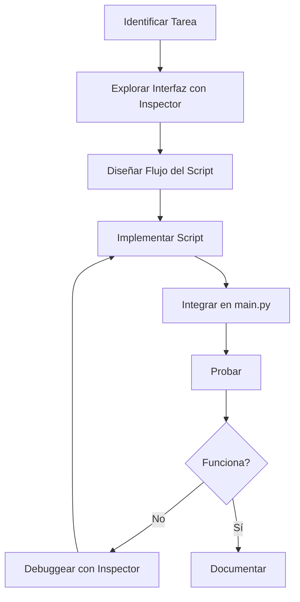
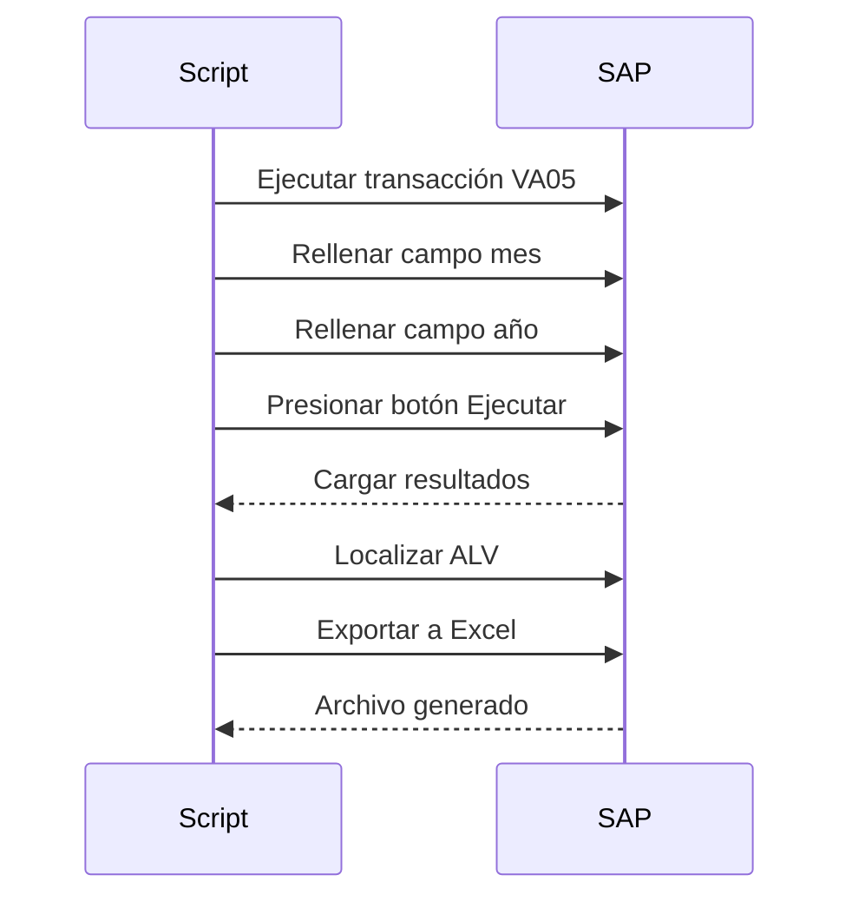

# Crear Nuevo Script

Esta guía describe el proceso completo para crear un script de automatización personalizado.

## Flujo de Desarrollo



## Paso 1: Identificar la Tarea

### Definir Objetivo

- ¿Qué transacción SAP se usa?
- ¿Qué datos se necesitan?
- ¿Cuál es el resultado esperado?

**Ejemplo**: Generar reporte de ventas mensual

- Transacción: `VA05`
- Entrada: Mes, año, organización de ventas
- Salida: Archivo Excel con reporte

### Identificar Nomenclatura de Transacción

Para identificar la nomenclatura de la transacción deseada:

1. Ejecutar la transacción
2. Clic en el menú **Sistema**
3. Clic en **Estat**
4. El nombre estará en el campo **Transacció**

## Paso 2: Explorar la Interfaz

### Usar SAP Inspector

```bash
# Abrir SAP manualmente y navegar a la transacción
# Ejecutar inspector
python -m src.utils.sap_inspector --output exploracion.json
```

### Identificar Componentes

Buscar en la salida del inspector:

- **Campos de entrada**: `GuiTextField`, `GuiCTextField`
- **Botones**: `GuiButton`  
- **Grids/Tablas**: `GuiShell` con `[ALV]`
- **Combos**: `GuiComboBox`

**Ejemplo de salida**:
```
GuiTextField | S_VBELN-LOW |wnd[0]/usr/ctxtS_VBELN-LOW [TXT]
GuiButton | btn[8] | wnd[0]/tbar[1]/btn[8] [BTN] [Text: Ejecutar]
GuiShell | shell | wnd[0]/usr/cntlGRID1/shellcont/shell [ALV]
```

### Anotar IDs

Crear tabla de componentes:

| Elemento | ID | Tipo |
|----------|--|----|
| Campo mes | `wnd[0]/usr/ctxtS_MONAT-LOW` | TextField |
| Campo año | `wnd[0]/usr/ctxtS_GJAHR-LOW` | TextField |
| Botón ejecutar | `wnd[0]/tbar[1]/btn[8]` | Button |
| Grid resultados | `wnd[0]/usr/cntlGRID1/shellcont/shell` | ALV |

## Paso 3: Diseñar el Script

### Diagrama de Secuencia



### Pseudocódigo

```
función run(mes, año):
    1. Ejecutar transacción VA05
    2. Rellenar filtros:
       - Mes = mes
       - Año = año
    3. Presionar "Ejecutar"
    4. Esperar carga de resultados
    5. Encontrar grid ALV
    6. Exportar a Excel
    7. Manejar popup de seguridad
    8. Retornar ruta del archivo
```

## Paso 4: Implementar el Script

### Crear Archivo

```bash
# Crear nuevo archivo en src/scripts/
notepad src/scripts/reporte_ventas.py
```

### Código Base

```python
import logging
import time
import os
from datetime import datetime
from typing import Optional
from src.core.sap_utils import find_alv_shell, handle_security_popup

logger = logging.getLogger("SAP_Automation")

class ReporteVentas:
    """
    Genera reporte mensual de ventas desde transacción VA05.
    
    Attributes:
        session: Sesión SAP activa
        config: Configuración del sistema
    """
    
    def __init__(self, session, config):
        """
        Inicializa el generador de reportes.
        
        Args:
            session: Sesión SAP GUI activa
            config: Diccionario de configuración
        """
        self.session = session
        self.config = config
        self.timeout = config.get('timeouts', {}).get('default_wait', 0.5)
    
    def run(self, mes: str, anio: str, org_ventas: str = "1000") -> bool:
        """
        Ejecuta la generación del reporte.
        
        Args:
            mes: Mes en formato MM (01-12)
            anio: Año en formato YYYY
            org_ventas: Organización de ventas (default: 1000)
            
        Returns:
            True si el reporte se generó exitosamente
        """
        logger.info(f"Generando reporte de ventas: {mes}/{anio}")
        
        try:
            # Paso 1: Ejecutar transacción
            self._ejecutar_transaccion()
            
            # Paso 2: Aplicar filtros
            self._aplicar_filtros(mes, anio, org_ventas)
            
            # Paso 3: Ejecutar búsqueda
            self._ejecutar_busqueda()
            
            # Paso 4: Exportar resultados
            archivo = self._exportar_resultados(mes, anio)
            
            logger.info(f"Reporte generado: {archivo}")
            return True
            
        except Exception as e:
            logger.error(f"Error generando reporte: {e}")
            return False
    
    def _ejecutar_transaccion(self) -> None:
        """Ejecuta la transacción VA05."""
        logger.debug("Ejecutando transacción VA05")
        self.session.findById("wnd[0]/tbar[0]/okcd").Text = "/nVA05"
        self.session.findById("wnd[0]").sendVKey(0)
        time.sleep(self.timeout)
    
    def _aplicar_filtros(self, mes: str, anio: str, org_ventas: str) -> None:
        """
        Rellena campos de filtro en la pantalla de selección.
        
        Args:
            mes: Mes (01-12)
            anio: Año (YYYY)
            org_ventas: Organización de ventas
        """
        logger.debug(f"Aplicando filtros: {mes}/{anio}, Org: {org_ventas}")
        
        # Mes
        try:
            campo_mes = self.session.findById("wnd[0]/usr/ctxtS_MONAT-LOW")
            campo_mes.Text = mes
        except Exception as e:
            logger.error(f"No se pudo rellenar mes: {e}")
            raise
        
        # Año
        try:
            campo_anio = self.session.findById("wnd[0]/usr/ctxtS_GJAHR-LOW")
            campo_anio.Text = anio
        except Exception as e:
            logger.error(f"No se pudo rellenar año: {e}")
            raise
        
        # Organización de ventas
        try:
            campo_org = self.session.findById("wnd[0]/usr/ctxtS_VKORG-LOW")
            campo_org.Text = org_ventas
        except Exception as e:
            logger.warning(f"No se pudo rellenar org. ventas: {e}")
    
    def _ejecutar_busqueda(self) -> None:
        """Presiona botón de ejecución."""
        logger.debug("Ejecutando búsqueda")
        try:
            boton = self.session.findById("wnd[0]/tbar[1]/btn[8]")
            boton.press()
            time.sleep(self.timeout * 4)  # Esperar carga de resultados
        except Exception as e:
            logger.error(f"Error ejecutando búsqueda: {e}")
            raise
    
    def _exportar_resultados(self, mes: str, anio: str) -> str:
        """
        Exporta resultados del ALV a Excel.
        
        Args:
            mes: Mes para nombre de archivo
            anio: Año para nombre de archivo
            
        Returns:
            Ruta completa del archivo exportado
        """
        logger.debug("Exportando resultados")
        
        # Encontrar ALV
        wnd = self.session.findById("wnd[0]")
        alv = find_alv_shell(wnd)
        
        if not alv:
            raise RuntimeError("No se encontró grid de resultados")
        
        logger.debug(f"ALV encontrado: {alv.RowCount} filas")
        
        # Trigger export
        alv.ContextMenu()
        alv.SelectContextMenuItem("&XXL")
        time.sleep(self.timeout)
        
        # Configurar exportación
        wnd1 = self.session.findById("wnd[1]")
        
        # Nombre de archivo
        filename = f"reporte_ventas_{anio}{mes}.xlsx"
        export_dir = self.config.get('export', {}).get('default_directory', '.')
        
        # Configurar formato Excel
        try:
            cmb_format = wnd1.findById("usr/ssubSUB_CONFIGURATION:SAPLSALV_GUI_CUL_EXPORT_AS:0512/cmbGS_EXPORT-FORMAT")
            cmb_format.Key = "XLSX"  # O el formato disponible
        except:
            logger.warning("No se pudo configurar formato de exportación")
        
        # Confirmar exportación
        try:
            wnd1.findById("tbar[0]/btn[0]").press()
        except:
            wnd1.findById("tbar[0]/btn[20]").press()
        
        time.sleep(self.timeout)
        
        # Guardar archivo
        try:
            wnd1 = self.session.findById("wnd[1]")
            wnd1.findById("usr/ctxtDY_PATH").Text = export_dir
            wnd1.findById("usr/ctxtDY_FILENAME").Text = filename
            wnd1.findById("tbar[0]/btn[0]").press()
        except Exception as e:
            logger.error(f"Error guardando archivo: {e}")
            raise
        
        # Manejar popup de seguridad
        handle_security_popup(self.session)
        
        return os.path.join(export_dir, filename)
```

## Paso 5: Integrar en main.py

### Importar Script

```python
# Agregar al inicio de main.py
from src.scripts.reporte_ventas import ReporteVentas
```

### Agregar Argumentos

```python
# En la sección de argumentos
parser.add_argument("--task", choices=["export_invoice", "reporte_ventas"])
parser.add_argument("--mes", type=str, help="Mes (01-12)")
parser.add_argument("--anio", type=str, help="Año (YYYY)")
parser.add_argument("--org-ventas", type=str, default="1000", help="Org. ventas")
```

### Agregar Dispatch

```python
# En la sección de dispatch de tareas
elif args.task == "reporte_ventas":
    if not args.mes or not args.anio:
        logger.error("Mes y año son requeridos para reporte_ventas")
        sys.exit(1)
    
    reporte = ReporteVentas(session, config)
    success = reporte.run(
        mes=args.mes,
        anio=args.anio,
        org_ventas=args.org_ventas
    )
    
    if success:
        logger.info("Reporte generado exitosamente")
    else:
        logger.error("Error generando reporte")
        sys.exit(1)
```

## Paso 6: Probar el Script

### Ejecución de Prueba

```bash
# Activar venv
.\venv\Scripts\Activate.ps1

# Ejecutar script
python main.py --task reporte_ventas --mes 11 --anio 2025
```

### Verificación

- [ ] SAP se conecta correctamente
- [ ] Transacción se ejecuta
- [ ] Filtros se aplican
- [ ] Resultados se muestran
- [ ] Exportación funciona
- [ ] Archivo se genera en ubicación correcta
- [ ] Logs muestran información apropiada

### Debugging

Si hay errores, usar el inspector para verificar IDs:

```bash
# Con SAP en la pantalla donde falla
python -m src.utils.sap_inspector --output debug.json

# Revisar IDs en debug.json
```

## Paso 7: Documentar el Script

### Crear Archivo de Documentación

Crea un archivo Markdown en `docs/` con el nombre del script:

```bash
# Ejemplo: docs/MI_SCRIPT.md
notepad docs\REPORTE_VENTAS.md
```

### Estructura del Documento

```markdown
# Nombre del Script

## Resumen
Breve descripción de qué hace el script.

## Uso

### Sintaxis Básica
\```powershell
python main.py --task nombre_tarea --parametro valor
\```

### Parámetros
| Parámetro | Requerido | Descripción | Valor por defecto |
|-----------|-----------|-------------|-------------------|
| `--parametro1` | Sí | Descripción | - |
| `--parametro2` | No | Descripción | valor_default |

### Ejemplos
\```powershell
# Ejemplo 1: Uso básico
python main.py --task mi_tarea --param1 valor1

# Ejemplo 2: Con opciones adicionales
python main.py --task mi_tarea --param1 valor1 --param2 valor2
\```

## Funcionalidad

Explicación detallada de cómo funciona el script:
1. Paso 1
2. Paso 2
3. Paso 3

## Archivos Generados

Descripción de los archivos de salida:
- Ubicación
- Formato
- Nomenclatura

## Notas y Limitaciones

- Nota 1
- Nota 2
- Limitación conocida

## Troubleshooting

### Error común 1
**Problema**: Descripción
**Solución**: Solución paso a paso
```

### Agregar a Navegación MkDocs

Edita `mkdocs.yml` y agrega el script en la sección **Scripts**:

```yaml
nav:
  ...
  - Scripts:
      - Login Automático SAP: LOGIN_AUTOMATICO.md
      - Exportación Multi-Cliente: MULTI_CLIENT_EXPORT.md
      - Reporte de Ventas: REPORTE_VENTAS.md  # ← NUEVO
  ...
```

### Verificar Documentación

```bash
# Iniciar servidor de documentación
mkdocs serve

# Abrir en navegador: http://127.0.0.1:8000
# Verificar que el script aparece en el menú "Scripts"
```

### Crear Docstring Completo en Código

```python
class ReporteVentas:
    """
    Genera reporte mensual de ventas desde SAP.
    
    El script se conecta a la transacción VA05, aplica filtros
    por mes/año y organización de ventas, ejecuta la búsqueda
    y exporta los resultados a formato Excel.
    
    Attributes:
        session: Sesión SAP GUI activa
        config: Configuración del sistema con timeouts y rutas
        timeout: Tiempo de espera entre operaciones
    
    Example:
        ```python
        from src.core.sap_connection import SAPConnection
        from src.scripts.reporte_ventas import ReporteVentas
        
        conn = SAPConnection(connection_mode="credentials", ...)
        session = conn.connect()
        
        reporte = ReporteVentas(session, config)
        success = reporte.run(mes="11", anio="2025")
        
        conn.disconnect()
        ```
    
    Notes:
        - Requiere permisos en transacción VA05
        - El formato de exportación depende de la configuración SAP
        - Los popups de seguridad se manejan automáticamente
    """
```

### Actualizar README

Agregar el nuevo script a la documentación del proyecto.

## Checklist Completo

### Planificación
- [ ] Objetivo del script definido
- [ ] Transacción SAP identificada
- [ ] Parámetros de entrada especificados
- [ ] Resultado esperado documentado

### Exploración
- [ ] Interfaz explorada con inspector
- [ ] IDs de componentes anotados
- [ ] Flujo de la transacción comprendido

### Implementación
- [ ] Archivo creado en `src/scripts/`
- [ ] Clase implementada con `__init__` y `run()`
- [ ] Métodos privados organizados lógicamente
- [ ] Logging agregado en puntos clave
- [ ] Excepciones manejadas apropiadamente
- [ ] Configuración del sistema utilizada

### Integración
- [ ] Script importado en `main.py`
- [ ] Argumentos CLI agregados
- [ ] Dispatch case implementado
- [ ] Validación de parámetros agregada

### Testing
- [ ] Prueba inicial realizada
- [ ] Errores identificados y corregidos
- [ ] Prueba con diferentes parámetros
- [ ] Edge cases considerados

### Documentación
- [ ] Docstrings completos en el código
- [ ] Crear archivo de documentación en `docs/`
- [ ] Agregar a navegación de MkDocs (`mkdocs.yml`)
- [ ] Incluir ejemplos de uso
- [ ] Documentar parámetros y opciones
- [ ] Notas y limitaciones documentadas
- [ ] README actualizado si es necesario

## Consejos

### Performance

- Usar `time.sleep(timeout)` apropiadamente
- No hacer polling excesivo
- Cachear búsquedas de componentes si se reutilizan

### Mantenibilidad

- Extraer IDs a constantes si se repiten:
  ```python
  CAMPO_MES_ID = "wnd[0]/usr/ctxtS_MONAT-LOW"
  ```
- Dividir métodos largos en pasos más pequeños
- Usar nombres descriptivos

### Robustez

- Validar parámetros de entrada
- Verificar que componentes existen antes de usarlos
- Proporcionar valores por defecto sensatos
- Manejar timeouts en operaciones largas

## Próximos Pasos

Una vez creado el script:

1. Considerar escribir tests unitarios
2. Agregar  validaciones de negocio
3. Optimizar performance si es necesario
4. Documentar en la wiki del equipo

## Referencias

- [Capa Scripts](../arquitectura/scripts.md): Patrones y arquitectura
- [Capa Core](../arquitectura/core.md): Utilidades disponibles
- [Capa Utils](../arquitectura/utils.md): Herramientas de soporte
