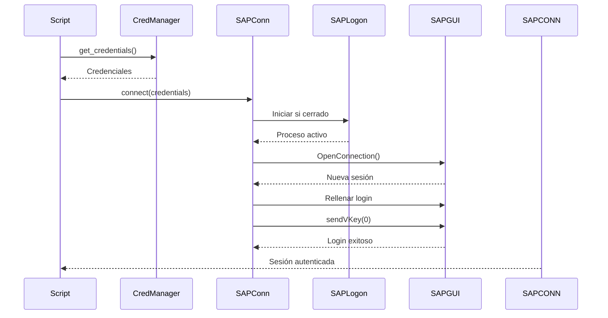

# Login Automático

Configuración del sistema de autenticación automática a SAP.

## Visión General

El sistema soporta login automático usando credenciales almacenadas de forma segura, eliminando la necesidad de abrir SAP GUI manualmente.

## Flujo de Autenticación



## Configuración Paso a Paso

### 1. Almacenar Credenciales

Editar `config/secrets.yaml`:

```yaml
sap_credentials:
  username: "Z1081401S"
  password: "mi_contraseña"
  client: "300"
  system_id: "SAP_ECOFIN"
  language: "ES"
```

**Campos**:
- `username`: Usuario SAP
- `password`: Contraseña SAP
- `client`: Mandante (ver en pantalla de login SAP)
- `system_id`: Identificador descriptivo (cualquier texto)
- `language`: Código de idioma (`ES`, `EN`, `CA`, `DE`, etc.)

### 2. Configurar Sistema SAP

Editar `config/settings.yaml`:

```yaml
sap:
  connection_mode: "credentials"
  connection_string: "ECOSISCAT - ESX - Produccio"
```

**connection_string**: Nombre EXACTO del sistema como aparece en SAP Logon.

### 3. Verificar Credenciales

```powershell
python -m src.utils.credential_manager get
```

**Salida esperada**:
```
Credenciales encontradas:
  Username:  Z1081401S
  Password:  ***
  Client:    300
  System ID: SAP_ECOFIN
```

### 4. Probar Login

```powershell
# SAP Logon NO necesita estar abierto
python main.py --task export_invoice --invoice 2025102419
```

## Obtener connection_string

### Método 1: SAP Logon Propiedades

1. Abrir **SAP Logon**
2. Click derecho en conexión
3. **"Propiedades"**
4. Copiar campo **"Descripción"** exactamente
5. Pegar en `connection_string`

### Método 2: Formato Técnico

Si falla descripción, usar:

```yaml
connection_string: "/H/servidor.dominio.com/S/3200"
```

Datos necesarios (de propiedades SAP Logon):
- Servidor: `ecosiscat.intranet.gencat.cat`
- Número de instancia: `00`
- Puerto: `3200` (instancia 00 → 3200, instancia 01 → 3201, etc.)

## Inicio Automático de SAP Logon

El sistema detecta si SAP Logon está cerrado e intenta iniciarlo automáticamente.

**Rutas buscadas**:
1. `C:\Program Files (x86)\SAP\FrontEnd\SAPgui\saplogon.exe`
2. `C:\Program Files\SAP\FrontEnd\SAPgui\saplogon.exe`
3. `C:\Program Files (x86)\SAP\SAPGUI\saplogon.exe`
4. `C:\Program Files\SAP\SAPGUI\saplogon.exe`

Si SAP Logon está en otra ubicación, iniciarlo manualmente antes de ejecutar el script.

## Comparación de Modos

| Característica | existing_session | credentials |
|----------------|------------------|-------------|
| SAP GUI abierto manualmente | ✅ Requerido | ❌ No necesario |
| Credenciales almacenadas | ❌ No | ✅ Sí |
| Inicio automático | ❌ No | ✅ Sí |
| Velocidad | ⚡ Rápido | 🐢 Más lento (+3s login) |
| Automatización desatendida | ❌ No | ✅ Sí |
| Seguridad | ✅ Alta (sin credenciales) | ⚠️ Media (credenciales en archivo) |
| Ideal para | Desarrollo, uso interactivo | Producción, scripts programados |

## Troubleshooting

### Error: "Invalid or missing credentials"

**Causa**: Credenciales no configuradas o incompletas

**Solución**:
```powershell
# Verificar credenciales
python -m src.utils.credential_manager get

# Si faltan, editar config/secrets.yaml
```

### Error: "connection_string not found"

**Causa**: Falta `connection_string` en settings.yaml

**Solución**:
```yaml
# Agregar en config/settings.yaml
sap:
  connection_string: "Nombre Sistema SAP"
```

### Error: "SAP Login failed: [mensaje]"

**Causas comunes**:
- Usuario o contraseña incorrectos
- Mandante (client) incorrecto
- Usuario bloqueado
- Contraseña expirada

**Solución**:
1. Verificar credenciales en `secrets.yaml`
2. Probar login manual en SAP GUI
3. Contactar administrador SAP si persiste

### Error: "Sintaxis no válida"

**Causa**: `connection_string` incorrecto

**Solución**:
1. Verificar descripción exacta en SAP Logon
2. Probar sin caracteres especiales (á → a, ó → o)
3. Usar formato técnico `/H/servidor/S/puerto`

### SAP Logon no inicia automáticamente

**Causa**: Instalación en ruta no estándar

**Solución**:
1. Iniciar SAP Logon manualmente antes del script
2. O actualizar rutas en `src/core/sap_connection.py`:
   ```python
   possible_paths = [
       r"C:\Ruta\Custom\saplogon.exe",
       # ... rutas existentes
   ]
   ```

## Seguridad

### Mejores Prácticas

✅ **Hacer**:
- Mantener `secrets.yaml` en `.gitignore`
- Cambiar contraseñas periódicamente
- No compartir `secrets.yaml`
- Usar nivel de logging WARNING o superior en producción

❌ **No hacer**:
- Commitear credenciales a git
- Compartir `secrets.yaml` por email/chat
- Hardcodear credenciales en código
- Usar credenciales de administrador

### Alternativas Más Seguras

Para mayor seguridad, usar **keyring del sistema**:

```powershell
# Almacenar en Windows Credential Manager
python -m src.utils.credential_manager set --username USER --password PASS --client 300 --system-id SYSTEM

# Modificar settings.yaml para usar keyring en lugar de secrets.yaml
# (editar credential_manager para priorizar keyring)
```

## Logs de Autenticación

Los logs muestran el proceso de login sin exponer contraseñas:

```
INFO - Connection mode: credentials
INFO - Loading credentials from credential manager...
INFO - Opening new connection to: ECOSISCAT - ESX - Produccio
DEBUG - Client set to: 300
DEBUG - Username set to: Z1081401S
DEBUG - Password set
INFO - Login successful
INFO - Successfully logged in to SAP: ECOSISCAT Client: 300
```

## Próximos Pasos

- [Crear Script](crear-script.md): Desarrollar automatización
- [Configuración](configuracion.md): Opciones avanzadas
- [Arquitectura Core](../arquitectura/core.md): Detalles de conexión
