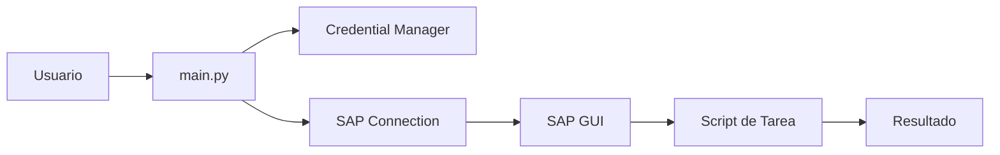

# Sistema de Automatización SAP

Documentación técnica del sistema de automatización para SAP GUI mediante scripting, con soporte para login automático y gestión segura de credenciales.

## Características Principales

- **Login Automático**: Conexión y autenticación automatizada a sistemas SAP
- **Gestión de Credenciales**: Almacenamiento seguro de credenciales SAP
- **Arquitectura Modular**: Diseño en capas para fácil extensión
- **Inspector SAP**: Herramienta para explorar interfaces durante desarrollo
- **Exportación Automatizada**: Tareas de exportación sin intervención manual

## Arquitectura del Sistema

El sistema está organizado en tres capas principales:

```
src/
├── core/      # Conexión y utilidades SAP fundamentales
├── scripts/   # Scripts de automatización específicos
└── utils/     # Herramientas de soporte y desarrollo
```

### Flujo General



## Inicio Rápido

### Instalación

```bash
# Clonar repositorio
cd c:\Users\Z1081401\Desktop\scripts_SAP

# Crear entorno virtual
python -m venv venv

# Activar entorno virtual
.\venv\Scripts\Activate.ps1

## Casos de Uso

### Automatización Desatendida

El sistema permite ejecutar tareas SAP sin intervención manual, ideal para:

- Exportaciones programadas
- Procesamiento batch
- Integraciones con otros sistemas
- Tareas repetitivas

### Desarrollo de Nuevas Funcionalidades

Incluye herramientas para facilitar el desarrollo:

- Inspector SAP para explorar interfaces
- Arquitectura modular para agregar scripts
- Sistema de logging completo
- Documentación de APIs

## Navegación

- **[Arquitectura](arquitectura/overview.md)**: Descripción detallada de cada capa
- **[Guías](guias/instalacion.md)**: Tutoriales paso a paso
- **[Referencia](referencia/configuracion.md)**: Documentación de configuración

## Tecnologías

- **Python 3.7+**: Lenguaje principal
- **pywin32**: Interacción con SAP GUI via COM
- **PyYAML**: Gestión de configuración
- **python-dotenv**: Variables de entorno
- **keyring**: Almacenamiento seguro de credenciales
